# HB/HE SiPM pulse shape with tuned shape 206 and zero-suppression flags (HBHEChannelInfo)

*CMSSW_17_0_0_pre2 · run of 2026-10-05 · `shapefit/` tree of the HCAL pulse-shape study*

## Summary

The goal of `shapefit/` is to tune the MC pulse shape 206 so that the average
output of the full HCAL digitizer chain matches the data shape 207. The tuned
shapes were tested with the same ZS-aware `HBHEChannelInfo` analysis used in
`default/`. It keeps only channels with `!isDropped()`, exactly the channels reco
turns into rechits. Shape 206 is the Y11 (scintillator + WLS fibre) time profile
convolved with the SiPM response. Three tuned versions were digitized:

| Variant | Y11 kernel `Y11206()` | SiPM kernel `analyticPulseShapeSiPMHE()` |
|---|---|---|
| `y11` | **iterC7** (tuned) | 2016 original |
| `sipm` | original | **iterB4** (tuned, 3-component) |
| `both` | iterC7 | iterB4 |

- **The `y11` variant (iterC7) is the best result.** It is the only tuned shape that
  moves MC towards data. In HE, the rms difference per time slice between MC and
  data digi drops from 0.035 (default shape) to **0.015**. In HB it drops from 0.069
  to **0.049**. The rms difference to shape 207 at the data-fitted phase falls in
  the same way.
- **Tuning the SiPM kernel (iterB4) makes the pulse far too fast.** The SOI fraction
  is 0.77–0.84 against 0.52–0.47 in data. That gives rms 0.12–0.17 to data, three to
  five times worse than the default shape.
- **The tunings do not add up.** In `both`, iterB4 dominates and the result is
  almost as bad as `sipm`. iterC7 and iterB4 were tuned separately, never jointly.
- **iterB4 also changes the noise.** With the SiPM-tuned kernel, ZS drops 98.8 % of HB
  channels (79 % otherwise) and 85 % of HE channels (63 % otherwise). The pre-SOI
  fractions also become negative (HB −0.043), which means the effective pedestal
  is over-subtracted. The most likely cause is that the SiPM dark-current
  simulation also uses shape 206 (section 4.2).
- **Against shape 207 at the fixed phase, iterC7 looks worse than the default shape.**
  This is a phase effect, not a shape effect. The fit loop aligned 207 about 6 ns
  later than the plotting convention, the same offset the data prefers (+6 ns HE,
  +7 ns HB) (section 2.3). At that phase iterC7 is clearly better.
- **The "isDropped" peak at TS5 in `HB_SiPM_8ts_chinfo_{sipm,both}.png` was a single
  channel.** Only 1 dropped HB channel passes the charge cut in those variants. The
  curve is now hidden below 20 channels, and its legend shows the channel count.

## 1. What is tuned

In CMSSW, shape 206 (`HcalPulseShapes::computeSiPMShapeHE206`) is

```
shape_206 = normalizeShift( convolve( analyticPulseShapeSiPMHE , Y11206 ), -2 ns )
```

- `analyticPulseShapeSiPMHE(t)` is the SiPM response: a sum of LogNormal
  components (`ROOT TMath::LogNormal(t, sigma, theta, m)`, with amplitudes
  `A = numerator / 6.94419`).
- `Y11206(t)` is the scintillator + Y11 WLS-fibre time profile:
  `A (1 − e^{−(t−shift)/n}) e^{−(t−shift)/t0}`, plus a Landau correction term
  (`norm`, `sigma`, `mpv = 0`, `frac = 0.11`). The digitizer also samples photon
  arrival times from `Y11206` per photon (`generatePhotonTime206`).

Parameters of the three variants:

| | A1num | S1 | TH1 | M1 | A2num | S2 | TH2 | M2 | A3num | S3 | TH3 | M3 |
|---|---|---|---|---|---|---|---|---|---|---|---|---|
| SiPM 2016 original (`y11`) | 5.204 | 0.5387 | −0.3976 | 4.428 | 1.855 | 0.8132 | 7.025 | 12.29 | – | – | – | – |
| SiPM iterB4 (`sipm`, `both`) | 5.204 | 0.2514 | −0.6166 | 2.5120 | 3.995 | 0.3225 | 11.9702 | 25.9863 | 1.443 | 0.4280 | −1.7463 | 1.1456 |

| | A | n | t0 | norm | sigma | shift |
|---|---|---|---|---|---|---|
| Y11 original (`sipm`) | 0.104204 | 0.44064 | 10.0186 | 0.0809882 | 20 | 7.2 |
| Y11 iterC7 (`y11`, `both`) | 0.104204 | **1.2000** | **11.2086** | 0.0809882 | 20 | 7.2 |

## 2. Parameter tuning history

### 2.1 Method (`pulse_shape_fitting/fit_iter.py`)

Shape 206 is applied *before* the detector simulation, so fitting it directly to
207 would apply the detector effects twice. Instead, each iteration:

1. Digitizes GEN-SIM with the currently installed shape 206 (`hcalpulse_gensim_cfg.py`,
   `ana/frac_vs_ts`, HE, 8 time slices, SOI at time slice 3).
2. Measures the digitizer distortion = digi − analytic shape 206, in the same 8 time slices.
3. Builds the target `target_206 = shape_207 − distortion`.
4. Fits the free parameters to `target_206`, using `differential_evolution` and a
   weighted χ² with the highest weights next to the SOI.
5. Installs the result in `HcalPulseShapes.cc`, rebuilds, re-digitizes and checks
   the real digitizer output against 207. This is the actual pass/fail test.

The figure of merit used throughout is Σ|digi − 207| over the 8 time slices,
in percentage points (pp), from `ana/` HE.

### 2.2 Iterations

**Phase A, 2-component SiPM kernel (`STATUS.md`, `report.md`)**

| Tag | Result | Digitizer HE TS3 / TS4 (%) |
|---|---|---|
| iterA1 | Fit did not converge. M1 = 0.84 ns, a sub-ns "spike" component. Not installed | – |
| **iterA2** | Converged and physically plausible; installed | 73.8 / 15.9 (target 51.8 / 35.4): **failed** at the digitizer level |
| iterA3, iterA4 | Each blocked escape route reopened another one: S1/TH1 collapse, then M1 collapse, with M2/TH2 stuck at their bounds | not installed |

Conclusion: the 2-component LogNormal has a structural ceiling for this target.

**Phase B, 3-component SiPM kernel (`STATUS_3COMPONENT.md`)**

| Tag | Result | Digitizer HE TS3 / TS4 (%) |
|---|---|---|
| iterB1–B3 | Spike or degenerate-overlap failures | not installed |
| **iterB4** | First plausible 3-component fit (all component widths > 1 ns, converged); installed | 73.5 / 16.8: **failed** at the digitizer level, same as iterA2 |

**Phase C, Y11 kernel, SiPM frozen at 2016 values (`STATUS_Y11206.md`)**

| Tag | Free parameters | Result | Digitizer HE TS3 / TS4 (%) | Σ\|res\| (pp) |
|---|---|---|---|---|
| iterC0 | baseline (original Y11) | – | 54.1 / 28.6 | 13.58 |
| iterC1–C5 | A, n, t0, norm, sigma | Bound-saturated. A, norm and sigma turned out to be nearly unconstrained by 8 time slices; n and t0 lie on a correlated ridge | – | – |
| iterC6 | n = 10.47, t0 = 7.30 | Fit-level best, digitizer overshoot | 46.4 / 31.0 | 19.47 |
| **iterC7** | n = 1.2 (capped), t0 = 11.21 | **passed**: first net improvement | **50.6 / 30.9** | **11.31** |
| iterC8 | n = 2.5, t0 = 10.57 | Slightly worse; reverted | 49.4 / 31.7 | 12.18 |
| iterC9 | n, t0, shift = 8.0 | Slightly worse; reverted | 49.7 / 31.6 | 11.57 |
| iterC10 | all 6 parameters | 4 of 6 stuck at their bounds. Installed, then **reverted to iterC7 before its digitizer test** (decision of 2026-10-05). Its values remain as comments in `Y11206()` | – | – |

### 2.3 Shape 207 phase in the fit loop vs the plots

- **The fit loop** (`hcal_pulse_shapes._shift_to_soi`) puts the 207 LUT time origin
  at the SOI leading edge, so the 207 peak (~18 ns) lies 18 ns into the SOI. In 8
  time slices this gives 207 = 51.8 / 35.4 / 8.0 / 3.2 / 1.7 % (TS3–TS7).
- **The plots** (`plot_from_fc.py`, fixed phase) put the 207 peak at the SOI-bin centre
  (12.5 ns), giving 65.9 / 23.7 / 6.3 / 2.7 / 1.5 %.
- **The two differ by about 6 ns.** Fitting the 207 phase to the data digi gives
  +6 ns (HE) and +7 ns (HB) relative to the plot convention (section 4.4). This
  reproduces the fit-loop alignment (HE: 50.8 / 36.2 %).

The fit loop therefore tuned 206 towards 207 at the phase that data prefers. In the
fixed-phase plots iterC7 appears to move *away* from 207, but this is only a phase
effect, not a shape effect.

## 3. Implementation

### 3.1 Variant switch

`CalibCalorimetry/HcalAlgos/src/HcalPulseShapes.cc` (local checkout in this tree)
reads `HCAL_SHAPE206_VARIANT` once and caches it:

- the accepted values are `y11` (also used when the variable is unset), `sipm` and `both`;
- any other value throws;
- the active variant is printed once per job as
  `[HcalPulseShapes] shape 206 variant = <v>`.

`analyticPulseShapeSiPMHE()` uses iterB4 for `sipm`/`both`. `Y11206()` uses iterC7
for `y11`/`both`. One build therefore serves all three variants. For the fit loop
(variable unset), the installed values are iterC7 + SiPM 2016.

**Only the GEN-SIM re-digi sees the tuned shape.** The GEN-SIM-DIGI-RAW digis come
from the production RelVal and always carry the **default** shape 206. Shape 208
(MC reco LUT) and 207 (data LUT) are hardcoded tables and are identical in all
output files (checked).

### 3.2 ZS-aware chain

This chain is the same as in `default/` (see `ZS_HBHEChannelInfo_report.md` there),
ported to this tree.

| Sample | ZS flag source | Reconstructor (`hbheInfo`) | Analyzer |
|---|---|---|---|
| MC (GEN-SIM re-digi ×3, DIGI-RAW) | `simHcalDigisMP`: realistic ZS re-run with `markAndPass = True` | `HBHEPhase1Reconstructor` clone, `saveInfos = True`, `dropZSmarkedPassed = True`, `saveDroppedInfos = True`, `makeRecHits = False` | `HBHEChannelInfoPulseAnalyzer` (`anaInfo`) |
| Data (JetMET0 RAW) | hardware mark-and-pass bit in `hcalDigis` | same | same |

- The analyzer takes `tsCharge = rawCharge − effective pedestal` (QIE pedestal + SiPM
  dark current), over 8 time slices with the SOI at time slice 3.
- It applies ΣQ > 5000 fC and skips `isDropped()` channels.
  `isDropped()` = taggedBadByDb ∨ dropByZS ∨ badSOI.
- Dropped channels passing the cut are profiled separately (`frac_vs_ts_dropped_*`).
- `anaInfoQIEPed` repeats the analysis with the QIE-only pedestal
  (`saveEffectivePedestal = False`) as a cross-check.
- The HE-only digi analyzer `ana/` (`HEPulseShapeAnalyzer`) still runs; it is what
  the fit loop reads.

## 4. Results

### 4.1 Validation of the variant switch

`ana/` HE 8-TS fractions (%) reproduce the earlier tagged fit-loop runs exactly:

| | TS3 | TS4 | TS5 | TS6 | TS7 | Reference |
|---|---|---|---|---|---|---|
| `y11` | 50.56 | 30.92 | 9.52 | 3.78 | 2.39 | iterC7: identical |
| `sipm` | 73.51 | 16.78 | 4.24 | 2.18 | 1.64 | iterB4: identical |
| `both` | 70.13 | 19.50 | 4.85 | 2.24 | 1.61 | new |
| DIGI-RAW (default shape) | 54.26 | 28.52 | 8.46 | 3.56 | 2.38 | |
| Data digi | 49.24 | 33.21 | 8.80 | 3.56 | 2.39 | |

### 4.2 Zero-suppression flag and pedestal

In the table, *pre-SOI* is the summed fraction in time slices 0–2 (`anaInfo`, effective
pedestal):

| Sample | Channels read | Dropped | Pass ΣQ cut | of which dropped | Kept | Pre-SOI |
|---|---|---|---|---|---|---|
| HB DIGI-RAW (default) | 9.07 M | 78.8 % | 14,529 | 43 | 14,486 | 0.011 |
| HB `y11` | 21.77 M | 78.9 % | 35,249 | 104 | 35,145 | 0.011 |
| HB `sipm` | 21.77 M | **98.8 %** | 15,075 | **1** | 15,074 | **−0.043** |
| HB `both` | 21.77 M | **98.8 %** | 15,145 | **1** | 15,144 | **−0.043** |
| HB data | 11.0 M | 0.0 % | 66,322 | 0 | 66,322 | 0.073 |
| HE DIGI-RAW (default) | 6.77 M | 62.5 % | 23,108 | 1,377 | 21,731 | 0.003 |
| HE `y11` | 16.24 M | 62.6 % | 53,279 | 3,137 | 50,142 | 0.003 |
| HE `sipm` | 16.24 M | **85.0 %** | 25,287 | 1,542 | 23,745 | −0.009 |
| HE `both` | 16.24 M | **85.1 %** | 25,364 | 1,557 | 23,807 | −0.009 |
| HE data | 19.8 M | 0.0 % | 335,815 | 0 | 335,815 | −0.013 |

- **The GEN-SIM input contains about 2.4 times more events than the DIGI-RAW file.**
  Channel counts should therefore be compared as fractions.
- **With the Y11 kernel only (`y11`), ZS behaves exactly as with the default shape.**
- **With the iterB4 SiPM kernel, ZS removes much more and the pedestal is
  over-subtracted.** The noise and dark-current part of the simulation uses the
  same shape 206. A different shape changes how much dark-current charge lands in
  the SOI, which is what the ZS threshold cuts on. It also changes how much lands in
  the readout window, which the DB effective pedestal assumes. This explanation
  needs to be confirmed in `HcalSiPMHitResponse`.
- **With the QIE-only pedestal (`anaInfoQIEPed`) the same pattern holds.** `y11` HB
  keeps 1.01 M channels, with the flat curve of the old analysis (pre-SOI 0.346).
  `sipm` keeps only 33.8 k (pre-SOI 0.099).

### 4.3 Comparison with the target shapes, fixed LUT phase

Each LUT is integrated into 25 ns slices with its peak at the SOI-bin centre.

On these plots:

- **Blue:** MC with the default shape (DIGI-RAW).
- **Black:** MC with the tuned shape (GEN-SIM re-digi).
- **Orange:** data digi.
- **Red:** data shape 207.
- **Green dashed:** MC reco shape 208, which is simulation-derived, not data.
- **Grey dashed:** dropped MC channels passing the cut, with their count N, for
  illustration only. This curve is hidden below 20 channels.

**`y11` (Y11 iterC7 + SiPM 2016)**
<p align="center">
  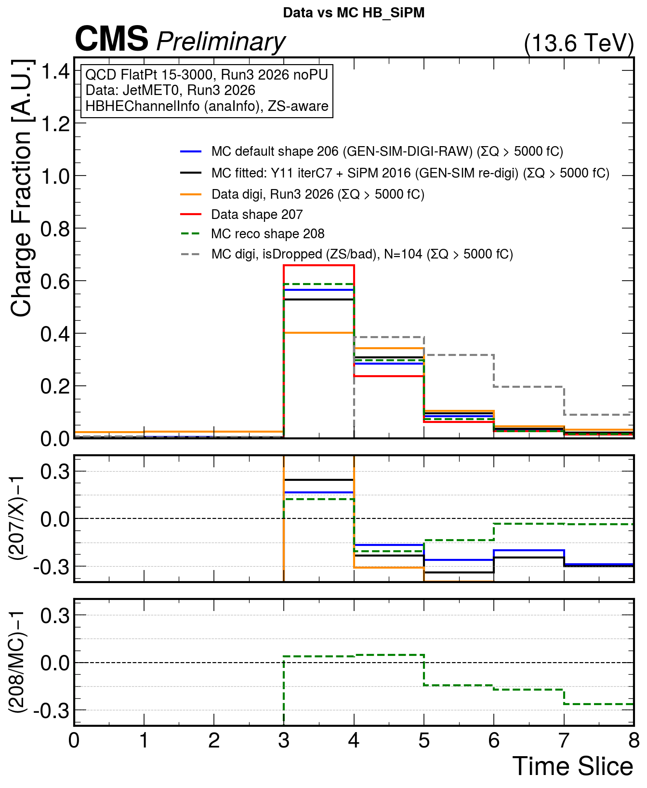
  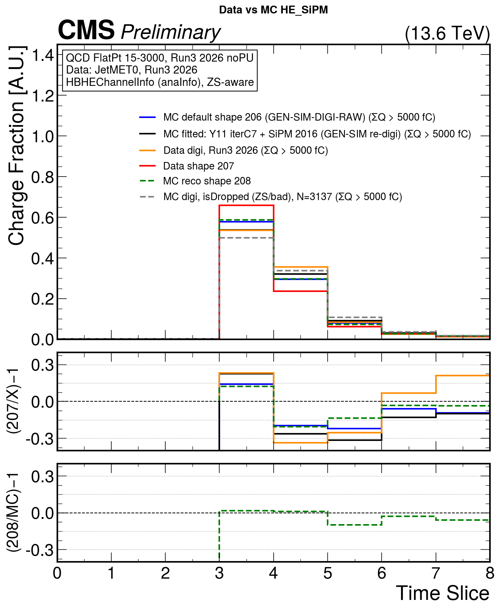
</p>

**`sipm` (Y11 original + SiPM iterB4)**
<p align="center">
  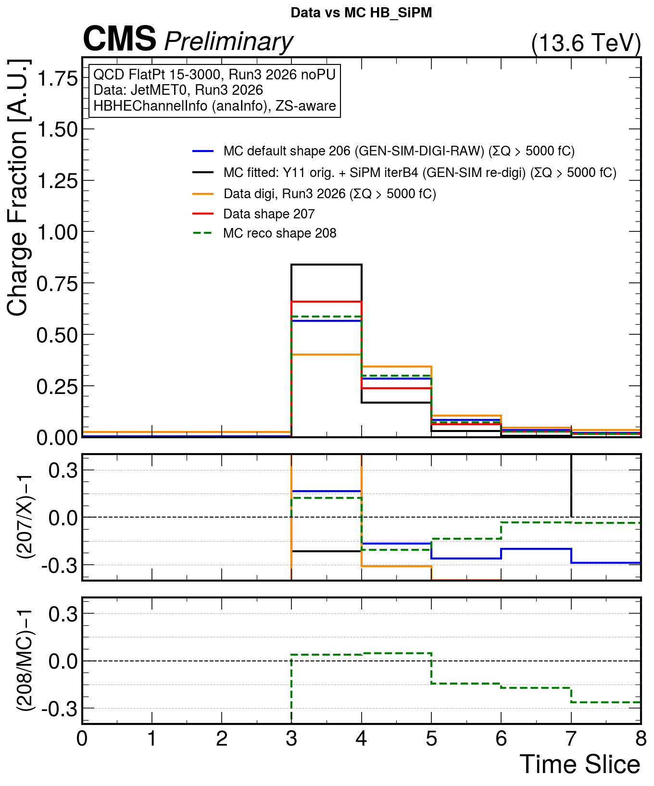
  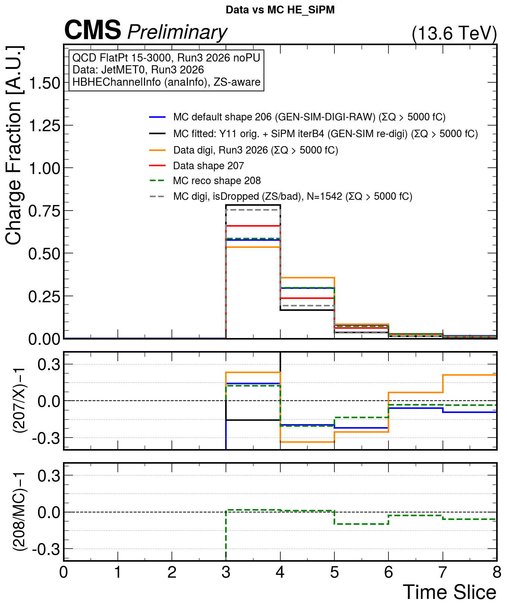
</p>

**`both` (Y11 iterC7 + SiPM iterB4)**
<p align="center">
  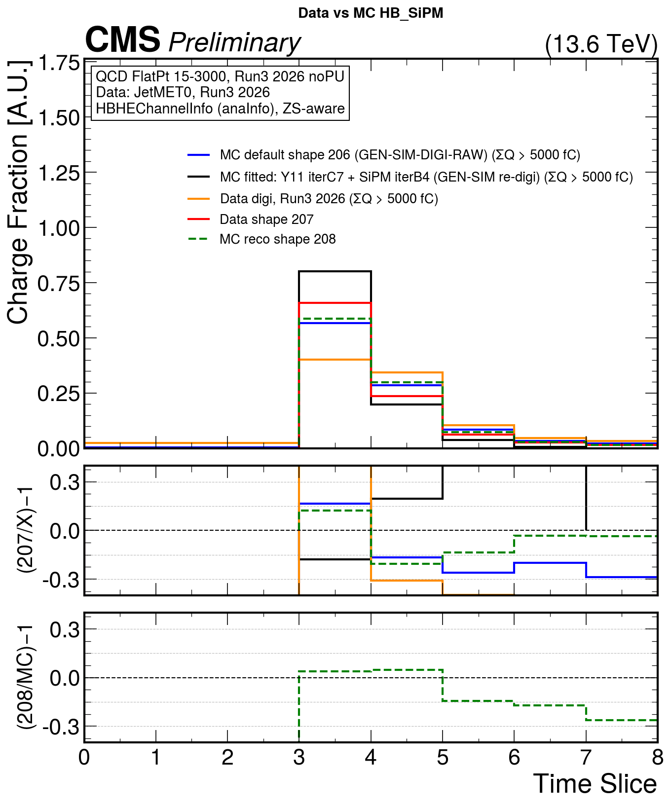
  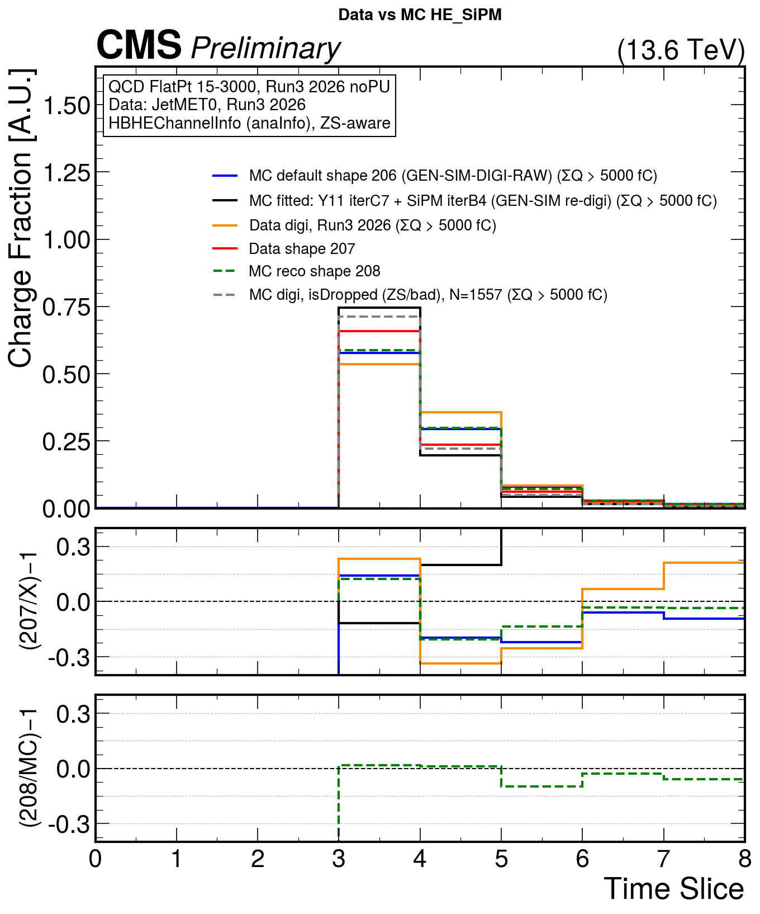
</p>

Charge fraction in the SOI (time slice 3) / time slice 4, `anaInfo`:

| | Shape 207 (fixed) | MC reco 208 | MC default | `y11` | `sipm` | `both` | Data digi |
|---|---|---|---|---|---|---|---|
| HB | 0.66 / 0.24 | 0.59 / 0.30 | 0.57 / 0.28 | 0.53 / 0.31 | 0.84 / 0.17 | 0.80 / 0.20 | 0.40 / 0.34 |
| HE | 0.66 / 0.24 | 0.59 / 0.30 | 0.58 / 0.30 | 0.54 / 0.32 | 0.78 / 0.17 | 0.75 / 0.20 | 0.54 / 0.36 |

- **`y11` moves charge from the SOI into time slice 4**, which is the direction of the
  data.
- **`sipm` and `both` move it the opposite way, by a large amount.**

### 4.4 Comparison with fitted LUT phase and baseline subtraction

As in `default/`, these plots:

- fit the time shift of each LUT (1 ns steps, ±40 ns, rms over time slices ≥ SOI):
  shape 207 to data digi, shape 208 to MC with the default shape (DIGI-RAW);
- subtract the flat pre-SOI baseline from each digi curve and renormalize;
- mask ratio bins where the LUT is empty, so baseline noise in time slices 0–2 is not
  drawn.

<p align="center">
  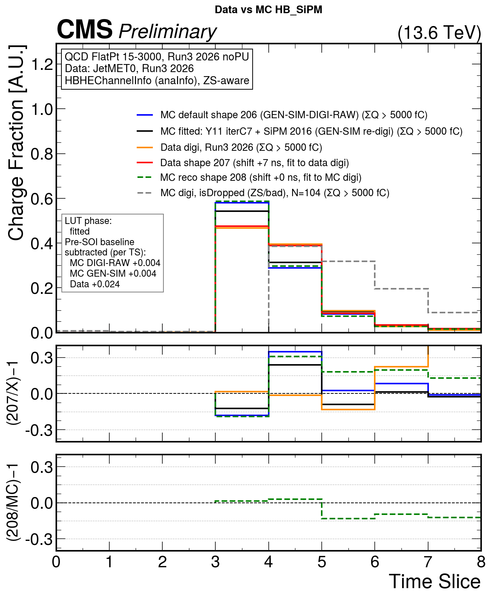
  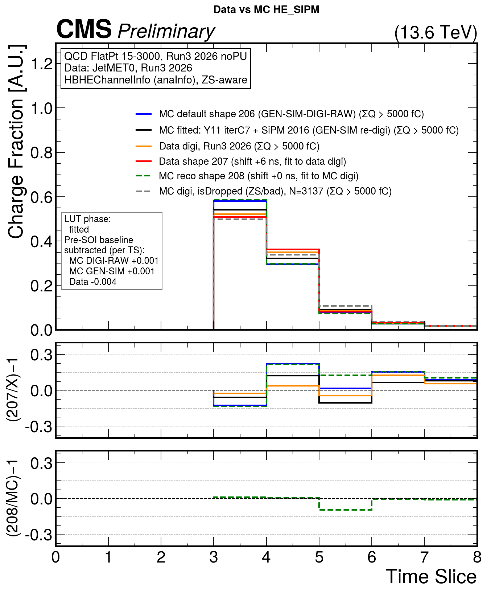
</p>
<p align="center">
  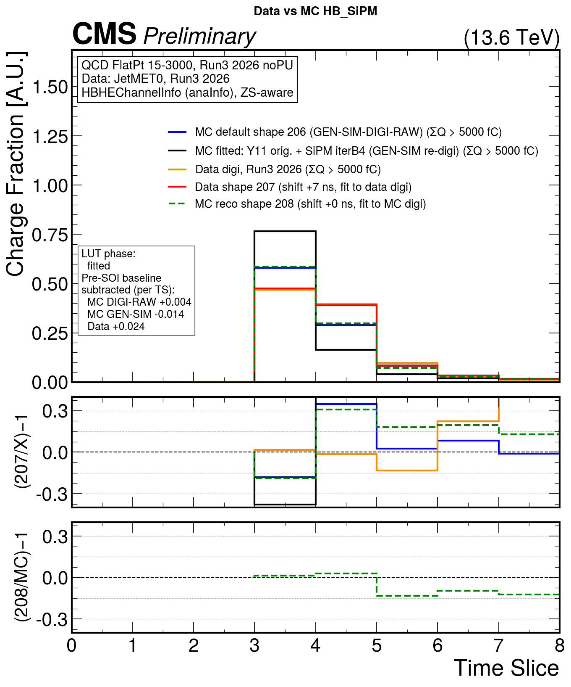
  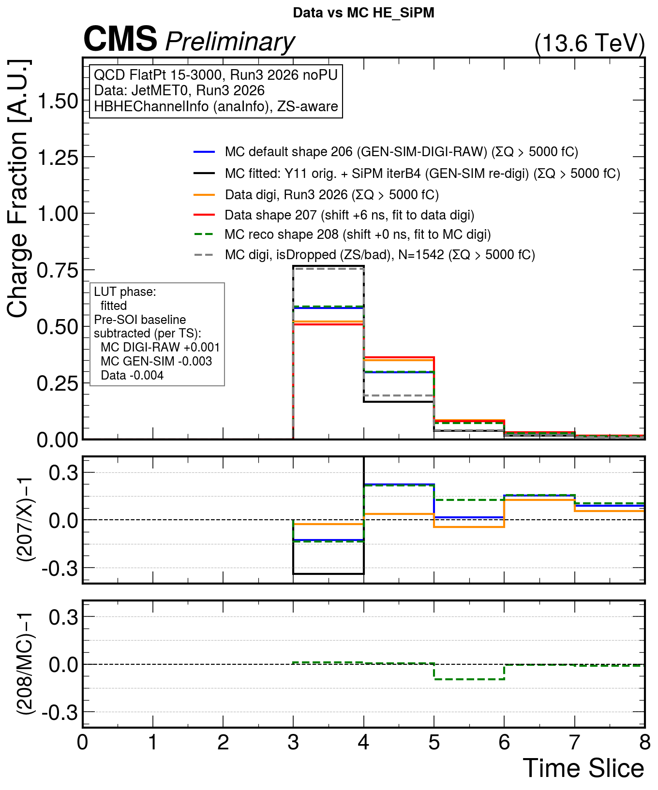
</p>
<p align="center">
  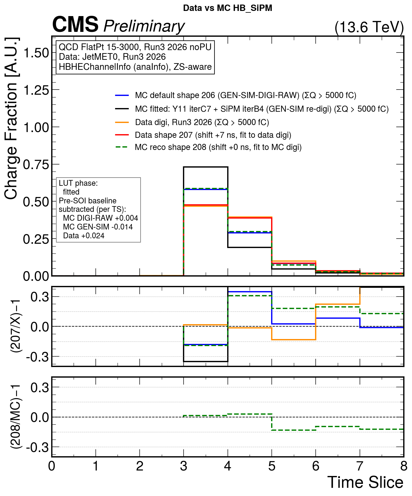
  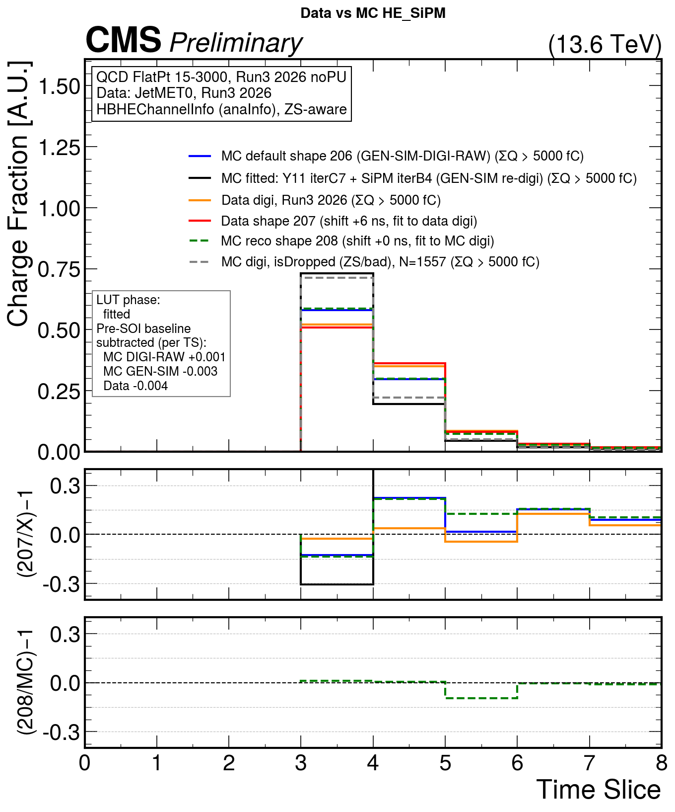
</p>

Fitted shifts: shape 207 vs data digi is **+7 ns (HB)** and **+6 ns (HE)**, with rms
0.008 / 0.009. Shape 208 vs MC with the default shape is **0 ns**, with rms
0.007 / 0.005. These are identical to `default/`, since 207, 208, the data and the
DIGI-RAW MC are the same.

rms per time slice (time slices ≥ SOI, baseline subtracted), lower is better:

| | MC default | `y11` | `sipm` | `both` |
|---|---|---|---|---|
| HB vs data digi | 0.069 | **0.049** | 0.171 | 0.151 |
| HB vs 207 (+7 ns) | 0.065 | **0.045** | 0.166 | 0.146 |
| HB vs 207 (fixed phase) | 0.048 | 0.068 | 0.088 | 0.068 |
| HE vs data digi | 0.035 | **0.015** | 0.138 | 0.118 |
| HE vs 207 (+6 ns) | 0.044 | **0.023** | 0.147 | 0.126 |
| HE vs 207 (fixed phase) | 0.046 | 0.067 | 0.065 | 0.044 |

TS4/TS3 ratio after baseline subtraction:

| | MC default | `y11` | `sipm` | `both` | Data digi | 207 (data-fitted phase) |
|---|---|---|---|---|---|---|
| HB | 0.50 | 0.58 | 0.21 | 0.26 | 0.85 | 0.82 |
| HE | 0.51 | 0.60 | 0.22 | 0.27 | 0.67 | 0.71 |

- **iterC7 more than halves the HE rms to data, but closes only part of the HB gap.**
  The HE rms to data falls from 0.035 to 0.015; HB has further to go
  (TS4/TS3 0.58 against 0.85).
- **iterC7 was tuned on HE only.** The HB improvement comes from the shared shape;
  HB was never fitted.
- **iterB4's shape is fixed relative to 208.** Its best 208 shift is −7 ns with rms
  0.03 in HB, so it is a much faster pulse, not a re-phased default pulse.

### 4.5 The isDropped curve at time slice 5 (HB `sipm` / `both`)

`frac_vs_ts_dropped_HB` in `sipm` and `both` contains **one** channel above 5000 fC.
That single pulse has 99–103 % of its charge in TS5, so it is a late or out-of-time
hit, not a pulse shape. With `y11` there are 104 such HB channels. Their curve
peaks at TS4–TS5 with a long tail, i.e. late pulses: the Run-3 ZS cuts on the SOI
ADC, and `isDropped()` cannot tell ZS apart from bad-SOI or channels flagged bad in
the DB. `plot_from_fc.py` now prints N in the legend and hides the curve below
`--min-dropped-entries` (20). None of these channels enter the result.

## 5. Conclusions and next steps

1. **Recommended shape: `y11` (Y11 iterC7, SiPM 2016).** It is digitizer-validated
   (Σ|res| 11.31 pp vs 13.58 pp for the default, `ana/` HE). It is also the best
   match to data and to the data-phased 207 in the ZS-aware analysis, for both HB
   and HE.
2. **Drop the SiPM-kernel tunings (iterA2, iterB4).** They pass the fit-level checks
   but fail at the digitizer level. They also change the simulated noise (ZS
   fraction, pedestal consistency).
3. **Don't use `both`.** Combining separately tuned kernels is not additive. A joint
   fit would have to re-measure the distortion with both kernels installed.
4. **The remaining HB/HE gap (TS4/TS3) needs either a further Y11 step or an HB-aware
   target.** The fit target is HE `ana/` only, so the next fit iterations should move
   to the ZS-aware `anaInfo` profiles, which is what reco sees. iterC8 and iterC9
   showed that large steps in n overshoot; small re-baselined steps from iterC7 are
   safer.
5. **Fix the 207 phase convention once.** The fit loop, the data fit and the fixed
   plotting convention differ by about 6 ns. A fixed, independently measured phase
   (Mahi template placement or TDC timing) would make "vs 207" numbers unambiguous.

## 6. Caveats

1. **Pileup.** The MC has no pileup and the data has pileup (HB data pre-SOI 0.073
   against 0.011 in MC). A pileup MC sample is needed for a fair data/MC comparison.
2. **Data statistics.** A single JetMET0 RAW file (run 401642) was processed.
3. **Sample.** QCD FlatPt 15–3000 RegeneratedGS noPU, with the per-channel cut ΣQ >
   5000 fC applied to dark-current-subtracted charge. The kept channels are near
   the 4 GeV isotrack convention but not identical to it.
4. **Different MC samples.** The tuned-shape MC (GEN-SIM re-digi) and the default-shape
   MC (production DIGI-RAW) are different event samples. They are produced with the
   same release and conditions, but they are not identical events.
5. **iterB4 noise effect.** The explanation in section 4.2 (the dark-current
   simulation uses shape 206) is a hypothesis. It is not yet confirmed in the
   simulation code.
6. **8 integrated time slices** constrain only part of the shape. Fitted phase and
   shape are partly degenerate (see `default/` report, section 3.4).

## 7. Reproducing

```bash
cd /afs/cern.ch/work/p/ptiwari/public/hcal/shapefit/CMSSW_17_0_0_pre2/src/HCALPulse/pulse_shape_study/test
./run_chinfo_variants.sh               # scram b, 3x GEN-SIM re-digi, DIGI-RAW, data, all plots
./run_chinfo_variants.sh --plots-only  # re-plot from the existing ROOT files
```

| File | Role |
|---|---|
| `CalibCalorimetry/HcalAlgos/src/HcalPulseShapes.cc` | tuned parameters + `HCAL_SHAPE206_VARIANT` switch (**core CMSSW file, local checkout, modified**) |
| `plugins/HBHEChannelInfoPulseAnalyzer.cc` | ZS-aware analyzer (`anaInfo`, `anaInfoQIEPed`) |
| `plugins/HEPulseShapeAnalyzer.cc` | HE digi analyzer (`ana`), read by the fit loop |
| `test/hcalpulse_gensim_cfg.py` | GEN-SIM re-digi with the tuned shape; output name from `HCALPULSE_OUT` |
| `test/hcalpulse_gensimdigiraw_cfg.py`, `hcalpulse_data_raw_cfg.py` | default-shape MC and data, same analysis |
| `test/plot_from_fc.py` | plots, see the README for the options |
| `test/run_chinfo_variants.sh` | full workflow; logs in `test/logs/` |
| `pulse_shape_fitting/fit_iter.py` | iterative inverse-distortion fit |
| `pulse_shape_fitting/STATUS*.md`, `report.md` | full iteration logs |

ROOT outputs: `edmHcalPulseShape_gensim_chinfo_{y11,sipm,both}.root`,
`edmHcalPulseShape_digiraw.root`, `edmHcalPulseShape_data.root`.
