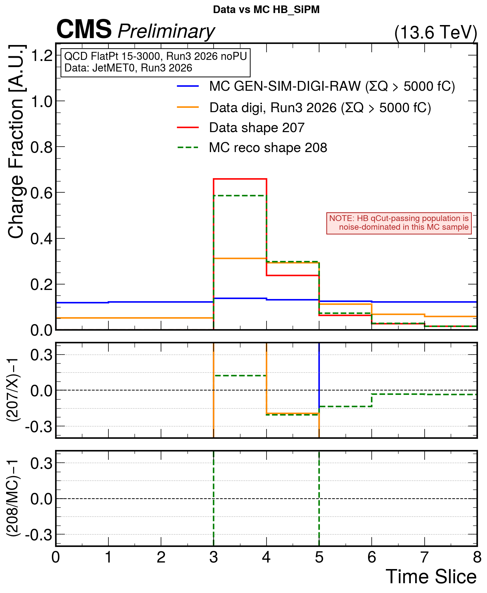
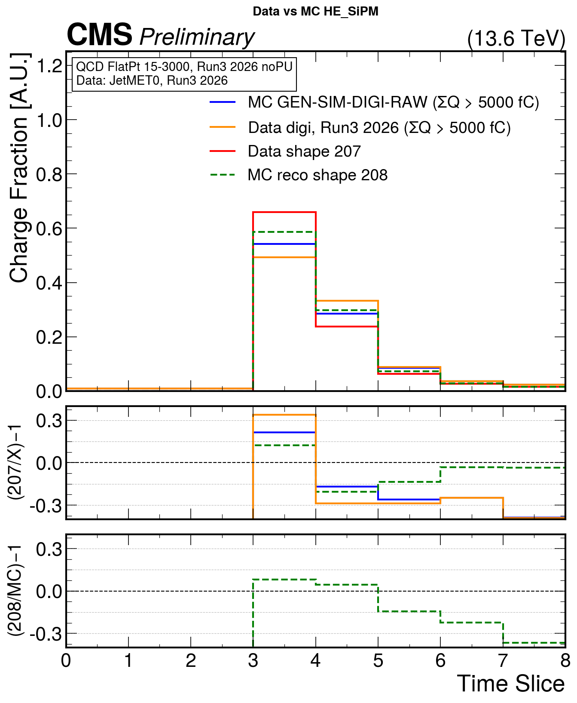
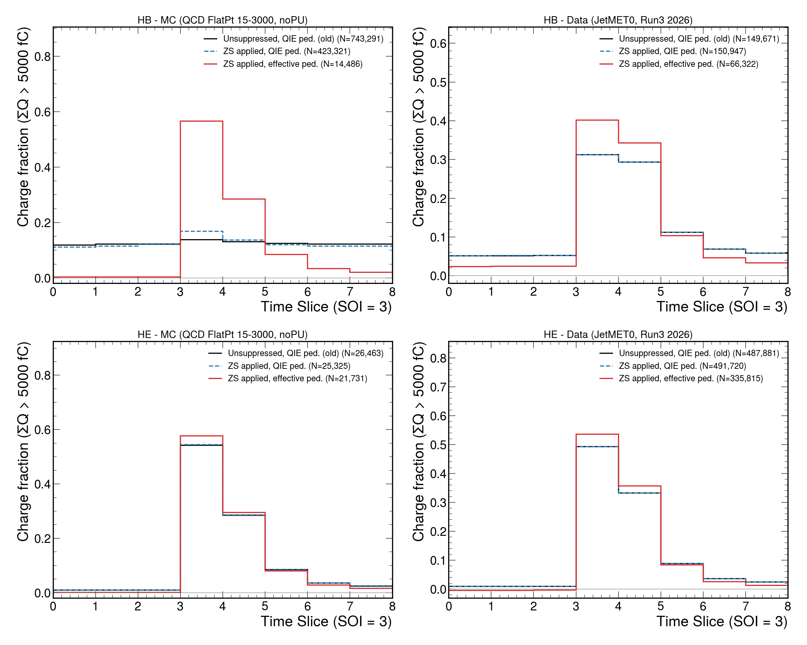
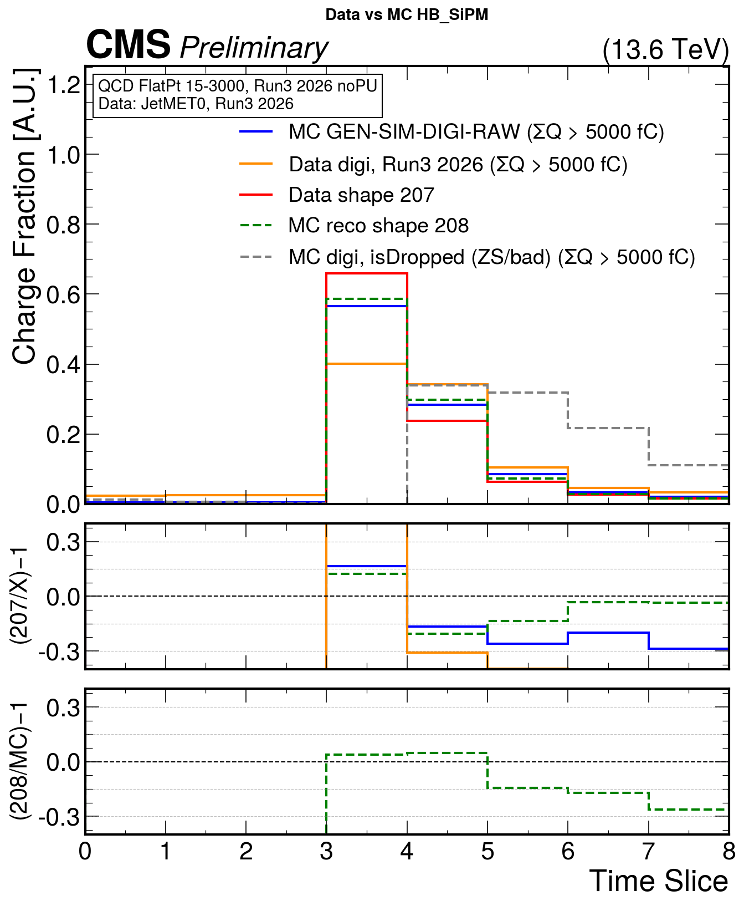
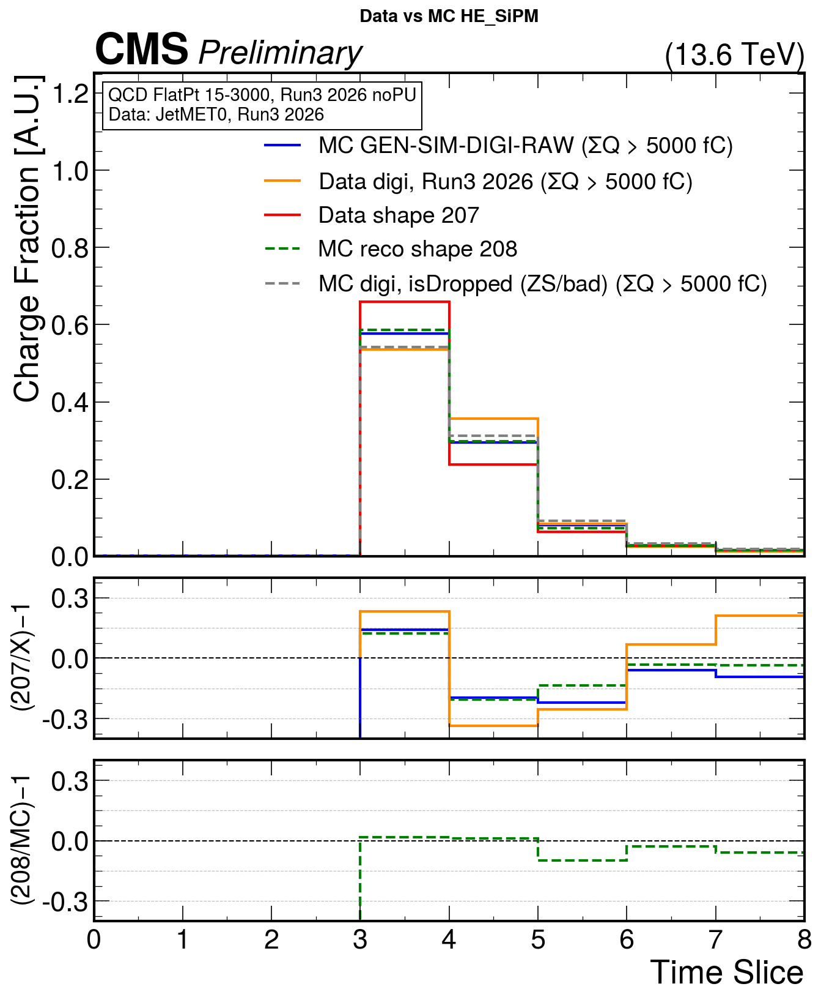

# HB/HE SiPM pulse shape with zero-suppression flags (HBHEChannelInfo)

*CMSSW_17_0_0_pre2 · run of 2026-09-28 · `default/` tree of the HCAL pulse-shape study*

## Summary

The MC HB charge-fraction distribution was flat, possibly because most of its
entries should be zero-suppressed. To test this, the analysis was changed to
(1) apply the `HBHEPhase1Reconstructor` drop flags
([L605](https://github.com/cms-sw/cmssw/blob/master/RecoLocalCalo/HcalRecProducers/src/HBHEPhase1Reconstructor.cc#L605))
and (2) run on `HBHEChannelInfo` instead of the digi collection
(`saveInfos = True`,
[cfi L45](https://github.com/cms-sw/cmssw/blob/master/RecoLocalCalo/HcalRecProducers/python/HBHEPhase1Reconstructor_cfi.py#L45)).

- **Both changes are in place.** The analysis now reads `HBHEChannelInfo` and keeps only
  channels with `!isDropped()`, which is exactly the set of channels reco turns into
  rechits. All 24 no-contamination checks pass.
- **The MC HB curve is no longer flat.** Its charge fraction in the sample of
  interest (SOI) rises from 0.14 to 0.57, close to MC reco shape 208 (0.59).
- **The ZS flags are applied, but the main cause of the flat shape was the pedestal.**
  - In MC, ZS flags 79 % of HB channels and removes about half of the old flat
    population above the charge cut. The remaining half still averages to a flat curve.
  - The pulse only appears once the **effective pedestal** (QIE pedestal + SiPM
    dark current) is subtracted. `HBHEChannelInfo` provides it; the old digi-based
    analysis subtracted only the QIE pedestal.

## 1. Before: old digi-based analysis

The old analysis used unsuppressed MC digis (`simHcalUnsuppressedDigis`), its own
ADC→fC conversion, the QIE pedestal only, and no ZS. The selection was
ΣQ(8 TS) > 5000 fC.

<p align="center">
  
  
</p>

The MC HB curve (blue, left) is flat at about 0.12 per time slice, built from 743k
channels passing the cut. HE (right) already shows a pulse.

## 2. Implementation

### Chain

| Sample | ZS flag source | Reconstructor (`hbheInfo`, `HBHEPhase1Reconstructor` clone) | Analyzer |
|---|---|---|---|
| MC | `simHcalDigisMP`: realistic ZS (`HcalRealisticZS`, per-channel DB thresholds, Run-3 era settings) re-run on the unsuppressed digis with `markAndPass = True` | `saveInfos = True`, `dropZSmarkedPassed = True`, `saveDroppedInfos = True`, `makeRecHits = False` | `HBHEChannelInfoPulseAnalyzer` (`anaInfo`) |
| Data | hardware mark-and-pass bit in the unpacked `hcalDigis` | same | same |

The MC ZS step is needed because standard MC ZS (`simHcalDigis`, `markAndPass = False`)
*removes* suppressed channels instead of flagging them, so `zsMarkAndPass()` is never
set in MC.

The reconstructor sets, per channel
([L501–504, L605](https://github.com/cms-sw/cmssw/blob/master/RecoLocalCalo/HcalRecProducers/src/HBHEPhase1Reconstructor.cc#L605)):

```cpp
dropByZS = dropZSmarkedPassed && frame.zsMarkAndPass();
channelInfo->setChannelInfo(..., taggedBadByDb || dropByZS || badSOI);   // -> isDropped()
const bool makeThisRechit = !channelInfo->isDropped();
```

The analyzer:

- takes `tsCharge(ts) = rawCharge − pedestal` for 8 time slices, SOI at time slice 3
  (`use8ts`);
- applies ΣQ > 5000 fC;
- **skips `isDropped()` channels** in the main profile, the tree and the time-slew
  histogram;
- profiles the dropped channels separately (`frac_vs_ts_dropped_*`) as a diagnostic.

`saveDroppedInfos = True` keeps the dropped channels in the collection so they can be
counted. They never enter the result.

### Verified configuration

The values below come from the fully expanded configs (`edmConfigDump` / `runpy`, era
modifiers applied):

| Parameter | MC | Data |
|---|---|---|
| `saveInfos` | True | True |
| `dropZSmarkedPassed` | True | True |
| `saveDroppedInfos` | True | True |
| `digiLabelQIE11` | `simHcalDigisMP:HBHEQIE11DigiCollection` | `hcalDigis` |
| `saveEffectivePedestal` | True (`hbheInfo`) / False (`hbheInfoQIEPed`, cross-check) | same |
| `use8ts` / `tsFromDB` | True / False | True / False |
| `simHcalDigisMP.markAndPass` | True | n/a |
| `anaInfo.skipDropped` | True | True |

## 3. Results

### 3.1 Zero-suppression flag

| Sample | Channels read | Dropped (`isDropped`) | Dropped among channels with ΣQ > 5000 fC |
|---|---|---|---|
| MC HB | 9.07 M | **78.8 %** | 43 / 14,529 |
| MC HE | 6.77 M | **62.5 %** | 1,377 / 23,108 |
| Data HB | 11.0 M | 0.02 % | 0 |
| Data HE | 19.8 M | 0.05 % | 0 |

In data, hardware ZS already removes suppressed channels before readout, so the flag
has almost no effect. It is still applied, so data and MC are processed identically.

### 3.2 Separating the ZS effect from the pedestal effect

To separate the two effects, each job also runs a reconstructor clone with ZS applied
but the **QIE-only** pedestal (`saveEffectivePedestal = False`, directory
`anaInfoQIEPed/`). Each panel shows three curves:

- **black:** old analysis;
- **blue dashed:** ZS only;
- **red:** ZS + effective pedestal (final).



In the table, *peak* is the charge fraction in the SOI (time slice 3) and *pre-SOI* is
the summed fraction in time slices 0–2.

| | Old (no ZS, QIE ped.) | + ZS (QIE ped.) | + ZS, effective ped. (**final**) |
|---|---|---|---|
| **MC HB**: N kept / peak / pre-SOI | 743,291 / 0.138 / 0.362 | 423,321 / 0.168 / 0.346 | **14,486 / 0.566 / 0.011** |
| **MC HE** | 26,463 / 0.543 / 0.028 | 25,325 / 0.544 / 0.029 | **21,731 / 0.578 / 0.003** |
| **Data HB** | 149,671 / 0.313 / 0.155 | 150,947 / 0.312 / 0.156 | **66,322 / 0.401 / 0.073** |
| **Data HE** | 487,881 / 0.492 / 0.028 | 491,720 / 0.492 / 0.028 | **335,815 / 0.535 / −0.013** |

**MC HB, step by step:**

- **ZS** removes 396k of the 819k channels above the cut, but the kept channels are
  still flat.
- **Subtracting the dark-current pedestal** removes almost all the rest
  (423k → 14.5k) and reveals the pulse.
- **The old flat curve was a leftover pedestal.** A pedestal left in all 8 time slices
  gives a flat profile, with ΣQ sitting just above the cut (old median ≈ 5.2k fC),
  matching the old HB curve.

HE is only mildly affected: the peak goes from 0.54 to 0.58. In data, ZS changes
nothing and the effective pedestal sharpens the peak.

### 3.3 After: final comparison with the target shapes

<p align="center">
  
  
</p>

On these plots:

- **Blue:** MC digi.
- **Orange:** data digi.
- **Red:** data shape 207.
- **Green dashed:** MC reco shape 208, which is simulation-derived, not data.
- **Grey dashed:** dropped MC channels passing the charge cut, for illustration only.
  They are not part of the result.

| Charge fraction | Shape 207 (data LUT) | MC reco 208 | MC digi | Data digi |
|---|---|---|---|---|
| HB, SOI (time slice 3) | 0.66 | 0.59 | 0.57 | 0.40 |
| HB, time slice 4 | 0.24 | 0.30 | 0.28 | 0.34 |
| HE, SOI (time slice 3) | 0.66 | 0.59 | 0.58 | 0.54 |
| HE, time slice 4 | 0.24 | 0.30 | 0.30 | 0.36 |

- **MC digi agrees with shape 208 to within a few %** in both HB and HE.
- **Both MC and data put less charge in the SOI and more in time slice 4 than shape
  207.** This is the known shape mismatch under study.
- **Data HB is noticeably later or broader than MC.** See caveats 1–3.
- **The dropped HE channels above the cut (grey) have a genuine pulse shape.** They are
  probably tagged bad in the database rather than ZS noise; `isDropped()` does not
  separate the two.

### 3.4 No-contamination checks

`check_outputs.py` runs over MC/data × HB/HE × `anaInfo` / `anaInfoQIEPed`, which is
24 checks. **All pass.** It checks that:

- no dropped channel is in the output tree;
- profile entries = tree entries = channels passing the cut and not dropped;
- passing − kept = dropped-profile entries;
- the SOI is at time slice 3 for every channel;
- the channel counters are not saturated.

## 4. Caveats and next steps

1. **Pileup.** The MC has no pileup; the data has pileup. Pileup from earlier bunch
   crossings is expected to raise the pre-SOI and time-slice-4 fractions in data
   (e.g. HB pre-SOI 0.073 in data vs 0.011 in MC). A pileup MC sample is needed for a
   fair data/MC shape comparison.
2. **Data statistics.** Only one JetMET0 file (run 401642) was processed; more runs
   and files are needed.
3. **Data HE pre-SOI is slightly negative (−0.013).** The effective pedestal
   over-subtracts a little in data, so the dark-current values in the data conditions
   should be checked.
4. **`isDropped()` covers more than ZS.** It includes ZS, bad-in-database and bad-SOI
   channels. For the result this is the right selection, since it matches the rechit
   selection exactly, but it cannot isolate ZS alone.
5. **The charge cut now applies to dark-current-subtracted charge.** The kept channels
   have a median raw energy of ~4–7 GeV, consistent with the 4 GeV isotrack
   convention. The cut could be restated as an explicit energy cut.

## 5. Reproducing

```bash
cd /afs/cern.ch/work/p/ptiwari/public/hcal/default/CMSSW_17_0_0_pre2/src/HCALPulse/pulse_shape_study/test
./run_all.sh        # scram b -> cmsRun MC + data -> plots -> check_outputs.py
```

| File | Role |
|---|---|
| `plugins/HBHEChannelInfoPulseAnalyzer.cc` | new analyzer reading `HBHEChannelInfo` |
| `test/hcalpulse_gensimdigiraw_cfg.py`, `hcalpulse_gensim_cfg.py`, `hcalpulse_data_raw_cfg.py` | ZS flags + `saveInfos = True` reconstructor clones |
| `test/plot_from_fc.py` | `--dir anaInfo --tag _chinfo --show-dropped` |
| `test/plot_zs_pedestal_check.py` | three-step ZS vs pedestal plot |
| `test/check_outputs.py` | no-contamination checks |
| `test/run_all.sh` | full workflow; logs in `test/logs/` |

No core CMSSW file was modified. `RecoLocalCalo/HcalRecProducers` is checked out
unmodified as a reference; the reconstructor settings are overridden only through
cfg clones.
